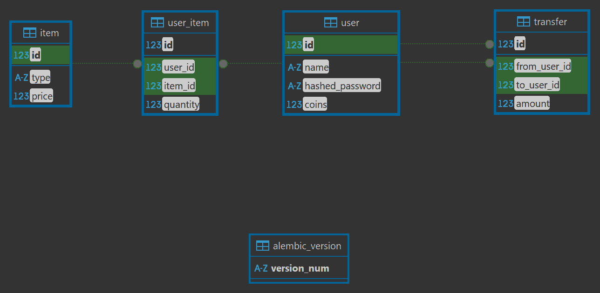

# avito-shop

## Запуск
1. docker compose up
2. docker compose exec avito-shop-service pytest - тесты
3. http://localhost:8080/docs - документация

## /auth
* Имя пользователя не менее одного символа, пароль не менее 8
* При первой авторизации создаю нового пользователя - 200
* При повторном обращении, если пароль такой же, как при первой аторизации - 200
* Если пароли не совпадают - 401
* Пароли хранятся в хэшированном виде

## /buy/{item}
* Предмета для покупки не существует - 400
* У пользователя недостаточно монет для покупки предмета - 400

## sendCoin
* Сумма для перевода >= 0
* При переводе 0 монет или переводе самому себе никаких операций не выполняется - 200
* Если у пользователя недостаточно средств для перевода - 400
* Если адресата перевода не существует - 400

## Схема БД

